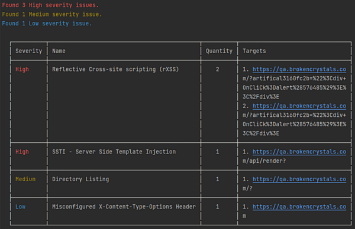

# @sec-tester/reporter

Provide an abstraction for generating test results as part of the particular test frameworks.

## Setup

```bash
npm i -s @sec-tester/reporter
```

## Usage

The package provides only one implementation of the `Reporter` that lets to get results to stdout, i.e. `StdReporter`:

```ts
import { Reporter, StdReporter } from '@secboox/reporter';

const reporter: Reporter = new StdReporter();
```

You just need to call the `report` method to send findings to stdout:

```ts
await reporter.report(scan);
```

<details>
<summary>Sample console output</summary>



</details>

## License

Copyright © 2022 [NeuraLegion](https://github.com/NeuraLegion).

This project is licensed under the MIT License - see the [LICENSE file](LICENSE) for details.
